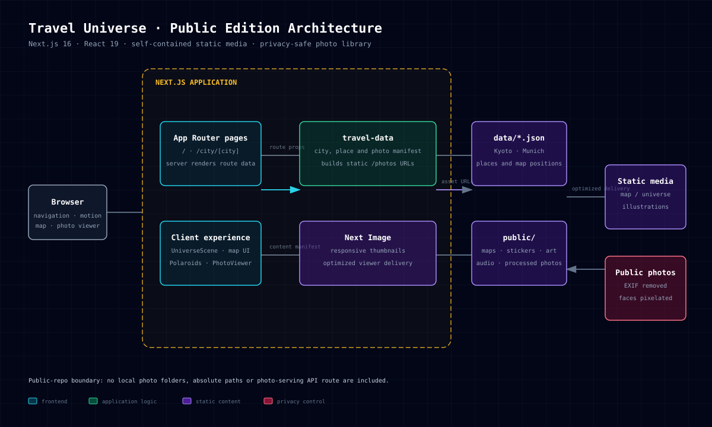

# Travel Universe

[English](README.md) | [简体中文](README.zh-CN.md)

An interactive travel-memory site built with Next.js, React, and Framer Motion.

## Run locally

1. Install dependencies with `npm install`.
2. Start the site with `npm run dev`.
3. Open `http://localhost:3000`.

The demo is self-contained: all display images are static files under `public/photos`, so it runs after cloning without access to any private photo library.

## Architecture

The [interactive diagram source](docs/travel-universe-architecture.html) describes the current public architecture: city JSON becomes a photo manifest and the app serves only static assets from `public/`.

## Visual assets

Maps, universe art and landmark stickers are produced as reviewable image assets, then connected to the UI through JSON and components. The [asset-production guide](docs/asset-production.md) includes reusable prompt templates, expected output requirements and shipped map/globe samples.

## Privacy notes

The public photo set has been re-encoded with EXIF metadata removed. Images containing detected front-facing people have been pixelated before inclusion. See [the privacy process](docs/privacy.md) before replacing or adding images.

Please perform your own review before publishing any new personal photos: face detection is helpful, but it is not a guarantee.
