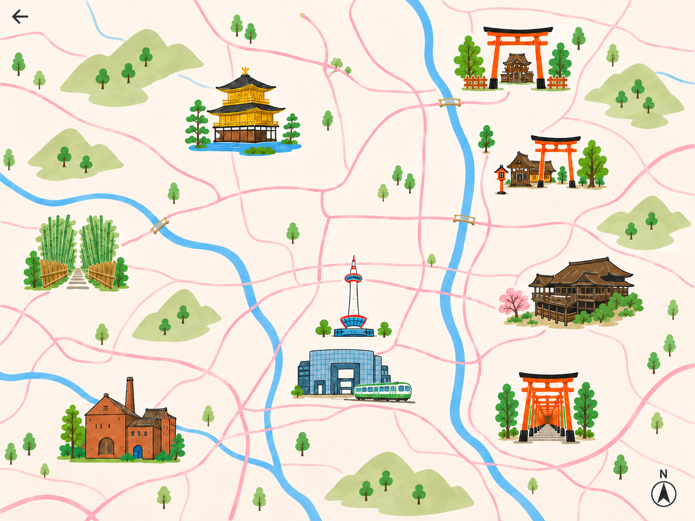
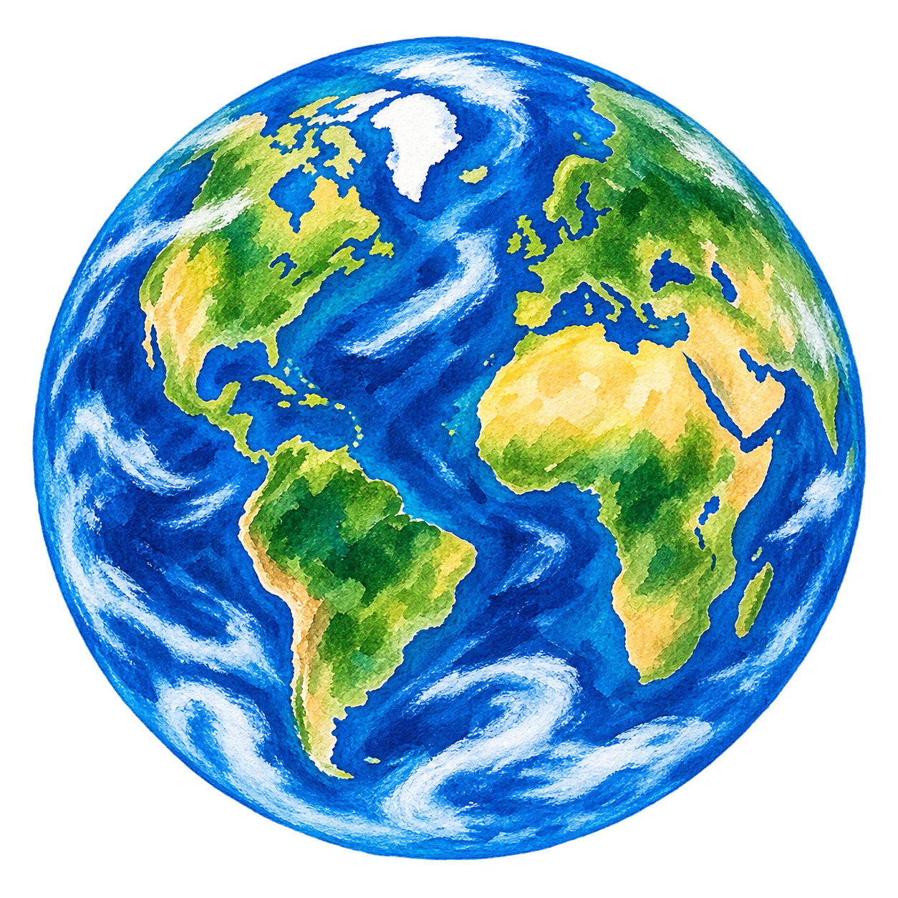

# 视觉素材生成

[English](asset-production.md) | [简体中文](asset-production.zh-CN.md)

项目刻意将 UI 插画与应用代码分离：先生成并审核素材，再把它放入 `public/`，最后通过城市 JSON 或组件引用。

## 工作流程

1. 为每次生成只选择一种视觉角色：**城市地图**、**宇宙地球**、**装饰环**或**地标贴纸页**。
2. 按所需比例生成；除贴纸页外，不在素材中生成 UI 文案或标签。
3. 按实际屏幕尺寸检查结果；地标变形时应重新生成，而不是勉强修图。
4. 导出 PNG，分别放入 `public/maps`、`public/illustrations` 或 `public/stickers`。
5. 在 `data/*.json` 或对应组件中接入素材。地点名称与交互坐标保留在 JSON／代码中，不烘焙进地图图片。

## 标准提示词：城市地图

替换方括号中的内容；不同城市应保留相同的风格段落。

```text
Create a 4:3 illustrated travel map for [CITY, COUNTRY].

Composition: warm ivory paper background; a simplified, non-geographic street network in soft blush pink; one or two broad sky-blue rivers; small green hills and hand-painted trees. Arrange these recognisable landmarks with generous empty space around each: [LANDMARK 1], [LANDMARK 2], [LANDMARK 3], [LANDMARK 4], [LANDMARK 5]. Use a friendly editorial travel-journal style: hand-drawn black outlines, watercolor and gouache texture, cheerful but restrained colours, clean silhouette, consistent landmark scale.

Include: a small north arrow and a simple back-arrow motif.
Do not include: people, cars in the foreground, photo-realism, dense building blocks, labels, captions, logos, watermarks, UI panels, borders, or text.
```

### 输出样例：京都地图

项目内输出为 [`public/maps/kyoto-map.png`](../public/maps/kyoto-map.png)。地标名称和可点击位置单独保存在 [`data/kyoto.json`](../data/kyoto.json)，因此地图可复用，也能避免生成文字出错。



## 标准提示词：宇宙地球

```text
Create a square, isolated watercolor-and-gouache illustration of planet Earth for a whimsical travel journal interface. View from space with the Americas, Europe and Africa visible; deep cobalt oceans, lush green continents, warm ochre deserts, soft white cloud swirls, visible handmade paint texture, playful but refined editorial illustration. The planet should be centered and nearly fill the canvas.

Output requirements: transparent background, no stars, no orbit ring, no text, no labels, no logo, no border, no watermark, no people, no photo-realism.
```

### 输出样例：宇宙地球

项目内输出为 [`public/illustrations/watercolor-earth-v1.png`](../public/illustrations/watercolor-earth-v1.png)。它与独立透明图层 [`travel-earth-ring-v1.png`](../public/illustrations/travel-earth-ring-v1.png) 叠放使用，因此轨道装饰可独立制作动画。



## 标准提示词：地标贴纸页

```text
Create a 4:3 landmark sticker sheet for [CITY, COUNTRY]. Draw [LIST OF LANDMARKS] as separate hand-painted travel stickers on a warm off-white background. Use watercolor and gouache fills with friendly dark outlines, matching a whimsical editorial travel-journal aesthetic. Arrange the stickers in a spacious grid and add a short English and local-language label directly beneath each sticker.

Do not include: people, scenery backgrounds, UI controls, logos, watermarks, photo-realism, borders, or overlapping stickers.
```

将贴纸页作为视觉参考；只有在实现确实需要单独地标图时才裁切或定位。不要依赖生成的文字作为应用数据，规范名称应保留在 JSON 中。
